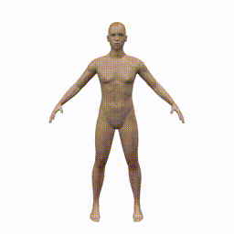
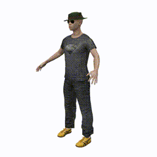
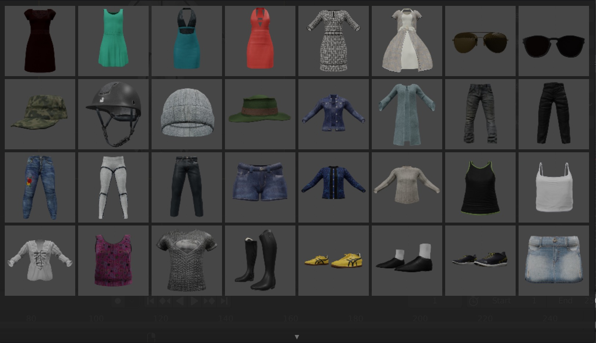
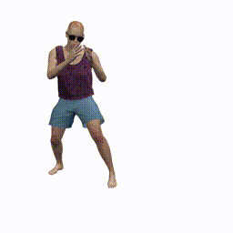

### License

[MIT](LICENSE)

### Install

1. Clone avatar ```git clone https://github.com/jsan3386/avatar ```
2. Download [cloth textures](https://cv.iri.upc-csic.es/Dataset/avatar/textures.zip) and extract files in avatar folder <br />
   ```cd $avatar/dressing ``` <br />
   ```mv $download_folder/testures.zip . ``` <br />
   ```unzip textures.zip ``` <br />
3. Move avatar folder to Blender addons folder <br />
   ```mv $avatar  $blender_install/$blender_version/scripts/addons ```<br />
4. In Blender>Edit>Preferences search for avatar and activate addon

### Features

#### Shape Parameters
1. Select Avatar body
2. Move shape sliders to desired body shape



#### Dressing Avatar
1. Select cloth garment from library
2. Load cloth to Avatar

 

#### Transfer BVH motion files
1. Select Avatar skeleton
2. Select bvh file skeleton (blender_repo, cmu, mixamo)
3. Load bvh file to Avatar



#### Code examples and further documentation
[Avatar Blender Add-on Docs](https://jsan3386.github.io/avatar/)


### Credits

- [Makehuman](http://www.makehumancommunity.org/)
    - Clothes mostly on Mindfront, punkduck 
<!--- - Marta Altarriba Fatsini - Motion transfer from set of 3D points -->
- Aniol Civit Bertran - Human model shape parameters
- Code and help from:
    - [Blender Stack Exchange](https://blender.stackexchange.com/)
    - [Blender Artists](https://blenderartists.org/)


### Citation

```bibtex
@misc{sanchezriera2021avatar,
      title={AVATAR: Blender add-on for fast creation of 3D human models}, 
      author={Jordi Sanchez-Riera and Aniol Civit and Marta Altarriba and Francesc Moreno-Noguer},
      year={2021},
      eprint={2103.14507},
      archivePrefix={arXiv},
      primaryClass={cs.GR}
}
```
